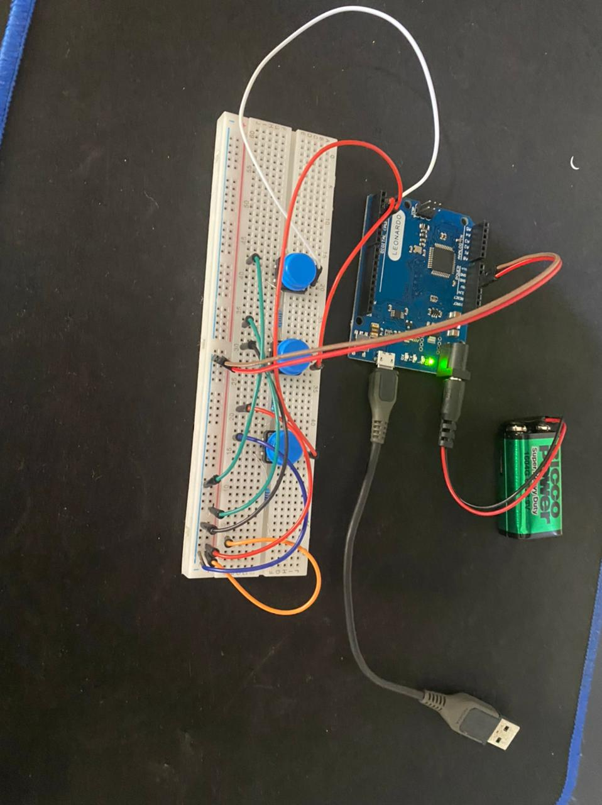
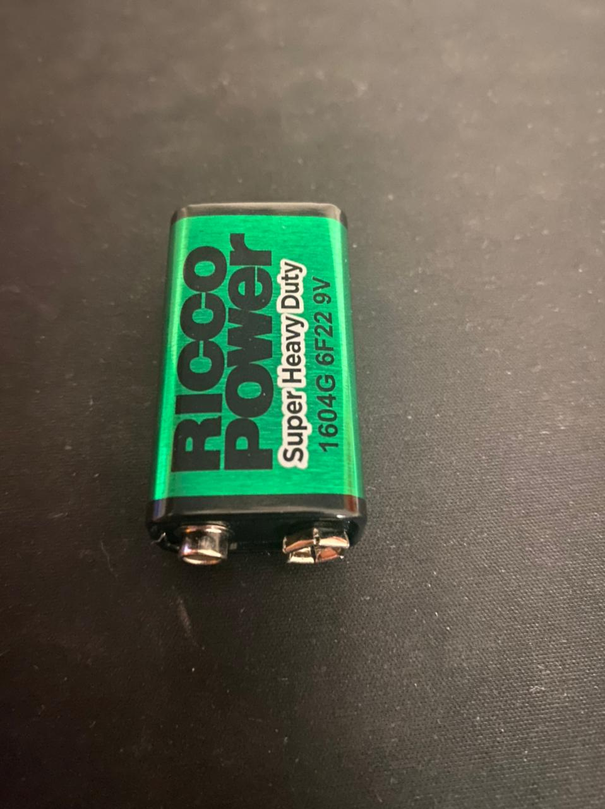
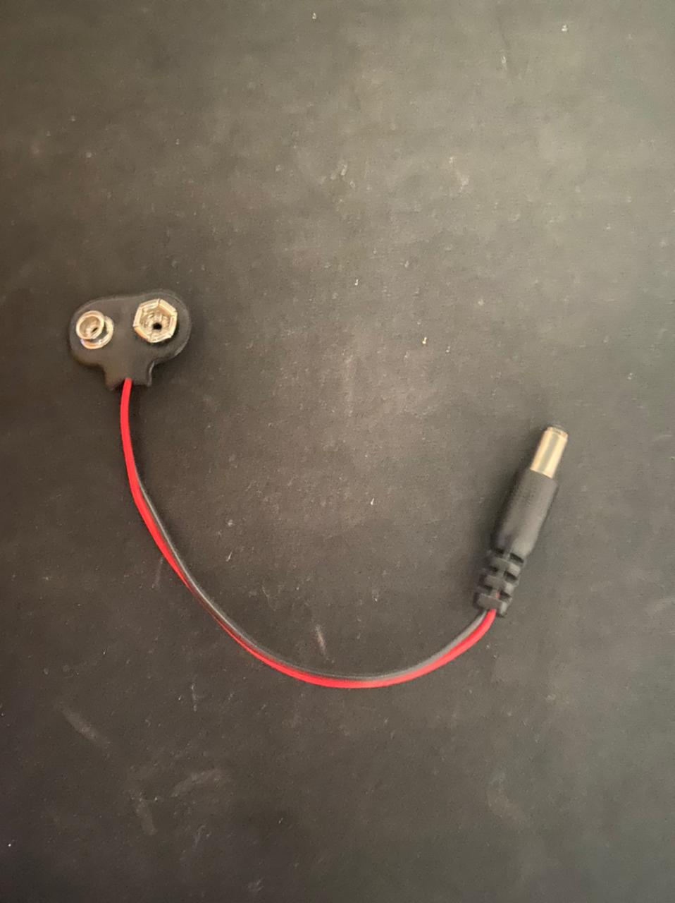

# Shell Auto Execute

[](https://nodesource.com/products/nsolid)

## Overview
This project involves creating a functional simulation of a Rubber Ducky bad USB device using an Arduino Leonardo. In some regions, acquiring a Rubber Ducky or having it shipped might be restricted. To overcome these limitations, this undertaking leverages an Arduino Leonardo board.

## Explanation
The Arduino Leonardo (or Arduino Micro) is powered by the ATmega32u4 processor. It operates akin to a keyboard by transmitting binary commands to the operating system, effectively emulating keyboard inputs. By capitalizing on this feature, the project aims to develop a script that emulates keyboard inputs to perform various actions, such as opening a command prompt, initiating HTTP requests, downloading payloads, and executing them automatically.

- The project employs components such as the Arduino Leonardo, a battery, three buttons, a breadboard, resistors, cables, and a USB-to-Micro USB adapter. The configuration button facilitates the selection of keyboard types (e.g., azerty, etc.). Notably, the code accommodates six languages. A reset button restores settings to the default (US keyboard), while the Start button activates the OS exploitation. The integration of a battery allows for preconfiguring the tool. For instance, if the target machine employs an azerty keyboard, preconfiguration is possible. Upon connecting the USB to the target machine, clicking the Start button is all that's required to initiate the process.

## Demonstration
>This is the main electrical assembly of my project


## Requirement
> (Bouton Poussoir 12*12*7.3MM) x 3
#
[](https://nodesource.com/products/nsolid)
>Arduino Leonardo
#
[](https://nodesource.com/products/nsolid)
> (1 - Resistor 1 kilo ohme) x3
#
[](https://nodesource.com/products/nsolid)
> (1 - cables male to male)
#
[](https://nodesource.com/products/nsolid)
> (1 - cables male to female)
#
[](https://nodesource.com/products/nsolid)
> (1 - Power resource)

> (1 - 9V BATTERY WITH DC)

## Installation 
#### Go to the file .ino and replace this link with your payload link to download it (http://192.168.0.108/stup.exe)
```diff
+ For the mounting check my youtube channel (Playlist security), you will find the channel on my profile
```
